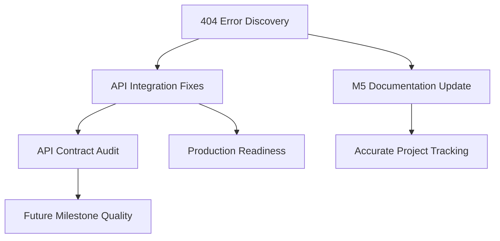

# Miscellaneous Tasks Summary

**Created:** Based on post-Milestone 5 testing findings  
**Context:** `/api/v1/auth/check` 404 error discovery led to broader API integration audit  

## Task Overview

| Task | Priority | Type | Effort | Status |
|------|----------|------|--------|--------|
| [API Integration Fixes](./misc-task-api-integration-fixes.md) | 🚨 Critical | Bug Fix | 4-6h | 🔴 Not Started |
| [API Contract Audit](./misc-task-api-contract-audit.md) | 🟡 High | QA/Tech Debt | 6-8h | 🔴 Not Started |
| [M5 Documentation Update](./misc-task-milestone5-documentation-update.md) | 🟢 Medium | Documentation | 2-3h | 🔴 Not Started |

**Total Estimated Effort:** 12-17 hours

## Execution Priority

### 🚨 **IMMEDIATE (Critical Path)**
1. **API Integration Fixes** - Addresses the root cause 404 errors
   - Fix `/api/v1/auth/check` endpoint
   - Fix password change endpoint mismatch
   - **Blocks**: All authentication functionality

### 🟡 **HIGH (Quality & Prevention)**
2. **API Contract Audit** - Prevents future issues
   - Comprehensive frontend/backend API audit
   - Integration testing framework
   - OpenAPI specification
   - **Enables**: Reliable development workflow

### 🟢 **MEDIUM (Process Improvement)**
3. **Milestone 5 Documentation Update** - Accurate project tracking
   - Update completion status to reflect reality
   - Document known issues and limitations
   - **Improves**: Project transparency and planning

## Root Cause Analysis

**Primary Issue**: Frontend-backend integration was not properly validated during Milestone 5

**Contributing Factors**:
- No API contract specification
- Missing integration tests
- Development in isolation (frontend vs backend)
- Overconfident completion reporting

**Systemic Impact**:
- Authentication system appears complete but has critical runtime failures
- Unknown scope of similar issues across other API endpoints
- Milestone completion status is inaccurate

## Dependencies & Relationships

## Success Criteria (All Tasks)

### **Immediate Fixes**
- [ ] No 404 errors on authentication endpoints
- [ ] Password change functionality works end-to-end
- [ ] Frontend authentication flow works without errors

### **Quality Improvements**
- [ ] Complete API contract specification exists
- [ ] Integration tests cover all critical API paths
- [ ] Automated contract validation in CI/CD
- [ ] Zero unknown API endpoint mismatches

### **Process Improvements**
- [ ] Milestone 5 status accurately reflects completion
- [ ] Known issues are documented and tracked
- [ ] Future milestones account for integration validation

## Impact Assessment

### **User Experience**
- **Before**: Broken authentication, 404 errors in console
- **After**: Seamless authentication experience

### **Development Workflow**
- **Before**: Runtime discovery of API mismatches
- **After**: Contract-driven development with early validation

### **Project Management**
- **Before**: Overconfident completion reporting
- **After**: Honest, accurate milestone tracking

## Notes & Lessons Learned

1. **Integration Testing is Critical**: UI and API development in isolation leads to runtime failures
2. **Contract-First Development**: API contracts should be established before implementation
3. **Honest Documentation**: Accurate completion reporting is essential for project health
4. **End-to-End Validation**: Milestone acceptance criteria should include integration testing

## Next Steps After Completion

1. **Apply lessons to future milestones**: Integrate API contract validation into all future development
2. **Establish integration testing standard**: Make API integration tests mandatory for milestone completion
3. **Regular API audits**: Schedule periodic frontend-backend contract validation
4. **Process documentation**: Document the integration testing requirements for future reference

---

**Created by**: Analysis of `/api/v1/auth/check` 404 error  
**Last Updated**: _[Current Date]_  
**Next Review**: After completion of critical path tasks 